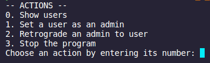

# Guide de déploiement

### Par Briend Donovan, Crispel Clément, El Mesaoudi Meftah Younes, Le Flohic Carole et Noyer Emilien

>## Sommaire
>[1. Contexte](#contexte)  
>[2. Rappel des fonctionnalités disponibles par un administrateur](#rappel-des-fonctionnalités-disponibles-par-un-administrateur)  
>[3. Rappel des fonctionnalités disponibles par un super-administrateur](#rappel-des-fonctionnalités-disponibles-par-un-super-administrateur)  
>[4. Nomage d'un administrateur ](#nomage-dun-administrateur )
___

## Contexte

Ce guide de déploiement servira au super-administrateur à se différencier des autres administrateurs, et de savoir comment nommer d’autres administrateurs. 

## Rappel des fonctionnalités disponibles par un administrateur

Tout d’abord voici un rappel des fonctionnalités supplémentaires qu’à un administrateur par rapport à un utilisateur lambda. 
Un administrateur peut : 
- Consulter la liste des utilisateurs inscrits
- Incarner un utilisateur (**attention** : cette fonctionnalité a été prévue afin qu’un administrateur puisse observer la vue d’un utilisateur, et donc vérifier que la vue est conforme aux souhaits des gérants du site. Si l’administrateur a modifié des données de son incarnation, l’administrateur devra donc être responsable de remettre par lui-même les données de l’utilisateur incarné à son état d’origine à la fin de son incarnation.) 

L'écran de fonctionnalité de l'administrateur devrait ressembler à : 

## Rappel des fonctionnalités disponibles par un super-administrateur

Le super-administrateur a aussi accès aux fonctionnalités précédentes, ainsi qu’à la fonctionnalité supplémentaire : ajouter des administrateurs. 

L'écran de fonctionnalité du super-administrateur devrait ressembler à : 

  

## Nomage d'un administrateur 

Pour nommer un administarteur, veuillez aller dans la rubrique ### : 

 

Vous verez ici la liste des utilisateurs, et aurez la possibilité de changer l'accés administrateur des utilisateurs. Cliquez alors sur ### : 

 

Confirmez la demande. Vous pouvez faire cela pour toutes les personnes n'étant pas super-administrateur.
Pour enlever le rôle d'administrateur à quelqu'un, il suffit de faire la même opération.
