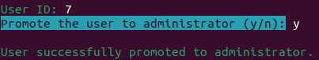

# Guide de déploiement

### Par Briend Donovan, Crispel Clément, El Mesaoudi Meftah Younes, Le Flohic Carole et Noyer Emilien

>## Sommaire
>[1. Contexte](#contexte)  
>[2. Prérequis](#prérequis)  
>[3. Rappel des fonctionnalités disponibles par un administrateur](#rappel-des-fonctionnalités-disponibles-par-un-administrateur)  
>[4. Rappel des fonctionnalités disponibles par un super-administrateur](#rappel-des-fonctionnalités-disponibles-par-un-super-administrateur)  
>[5. Nomage d'un administrateur ](#nomage-dun-administrateur )
___

## Contexte

Ce guide de déploiement servira au super-administrateur à se différencier des autres administrateurs, et de savoir comment nommer d’autres administrateurs. 


## Prérequis

Afin de pouvoir travailler sur ce projet, vous aurez besoin d'avoir sur votre ordinateur 

- Python et Symfony d'installés. 

    (Si ce n'est pas le cas, alors : 

    Pour télécharger Python : https://www.python.org/downloads/ 

    Pour télécharger Symfony : https://symfony.com/download

    Pour Symfony, nous vous recommandons de télécharger la version **binaire AMD64**.)

- et d'exécuter les commandes suivantes sur un terminal : 

    ```
    $ pip install mysql-connector-python 
    ```

    (Cela insinue donc que vous pouvez utiliser les commandes ```pip install```.) 


## Rappel des fonctionnalités disponibles par un administrateur

Tout d’abord, voici un rappel des fonctionnalités supplémentaires qu’a un administrateur par rapport à un utilisateur lambda. 
Un administrateur peut : 
- Consulter la liste des utilisateurs inscrits
- Incarner un utilisateur (**attention** : cette fonctionnalité a été prévue afin qu’un administrateur puisse observer la vue d’un utilisateur, et donc vérifier que la vue est conforme aux souhaits des gérants du site. Si l’administrateur a modifié des données de son incarnation, l’administrateur devra donc être responsable de remettre par lui-même les données de l’utilisateur incarné à son état d’origine à la fin de son incarnation.) 


## Rappel des fonctionnalités disponibles par un super-administrateur

Le super-administrateur a aussi accès aux fonctionnalités précédentes, ainsi qu’à la fonctionnalité supplémentaire : ajouter des administrateurs. 

L'écran de fonctionnalité du super-administrateur devrait ressembler à : 

  


## Nomage d'un administrateur 

Avant d'utiliser le script Python, veuillez vérifier que le fichier **.env** dans le dossier de votre projet Symfony contient la bonne base de données.

Pour nommer un administrateur, veuillez utiliser le script Python **adminmanager.py**. Il se trouve dans le dossier de votre projet Symfony.

Vous aurez ensuite 3 options se présentant à vous : voir la liste des utilisateurs, promouvoir un utilisateur et rétrograder un administrateur.

Voici un exemple de *l'affichage des utilisateurs* : 

 

Ainsi que celui d'une *promotion* : 

 

Enfin, un exemple d'une *rétrogradation* : 

 