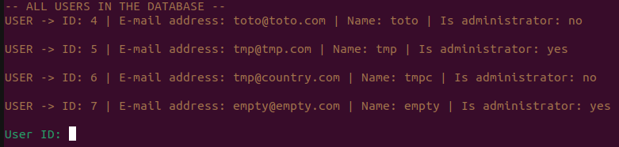
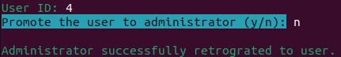

# Guide de déploiement

### Par Briend Donovan, Crispel Clément, El Mesaoudi Meftah Younes, Le Flohic Carole et Noyer Emilien

>## Sommaire
>[1. Contexte](#contexte)  
>[2. Prérequis](#prérequis)  
>[3. Rappel des fonctionnalités disponibles par un administrateur](#rappel-des-fonctionnalités-disponibles-par-un-administrateur)  
>[4. Rappel des fonctionnalités disponibles par un super-administrateur](#rappel-des-fonctionnalités-disponibles-par-un-super-administrateur)  
>[5. Nomage d'un administrateur ](#nomage-dun-administrateur )
___

## Contexte

Ce guide de déploiement servira au super-administrateur à se différencier des autres administrateurs, et de savoir comment nommer d’autres administrateurs. 


## Prérequis

Afin de pouvoir travailler sur ce projet, vous aurez besoin d'avoir sur votre ordinateur 

- Symfony d'installé. 

    (Si ce n'est pas le cas, alors : 

    Pour télécharger Symfony : https://symfony.com/download

    Pour Symfony, nous vous recommandons de télécharger la version **binaire AMD64**.)

- et de savoir utiliser votre terminal


## Rappel des fonctionnalités disponibles par un administrateur

Tout d’abord, voici un rappel des fonctionnalités supplémentaires qu’a un administrateur par rapport à un utilisateur lambda. 
Un administrateur peut : 
- Consulter la liste des utilisateurs inscrits
- Incarner un utilisateur (**attention** : cette fonctionnalité a été prévue afin qu’un administrateur puisse observer la vue d’un utilisateur, et donc vérifier que la vue est conforme aux souhaits des gérants du site. Si l’administrateur a modifié des données de son incarnation, l’administrateur devra donc être responsable de remettre par lui-même les données de l’utilisateur incarné à son état d’origine à la fin de son incarnation.) 


## Rappel des fonctionnalités disponibles par un super-administrateur

Le super-administrateur a aussi accès aux fonctionnalités précédentes, ainsi qu’à la fonctionnalité supplémentaire : ajouter des administrateurs. 

Cela se fait à partir de son terminal, depuis le dossier du projet symfony.

## Nomage d'un administrateur 

Avant d'utiliser le script de commandes, veuillez vérifier que le fichier **.env** dans le dossier de votre projet Symfony contient la bonne base de données.

Pour nommer un administrateur, veuillez ouvrir un terminal depuis votre dossier symfony. Veuillez ensuite taper la commande suivante : 

```
symfony console administration:manage
```

Cela permettra de lancer le programme. 

Le script va alors commencer en vous montrant la liste des utilisateurs, avec leur ID, mail, nom, et s'ils sont ou non des administarteurs : 

 

Après cela, veuillez entrer l'ID de l'utilisateur auquel vous voulez retoucher. Vous pouvez toujours utiliser CTRL+C si vous voulez annuler votre traitement.

Après avoir saisie l'ID de la personne, vous aurez le choix entre *promouvoir* un utilisateur, ou le *rétrograder*. Envoyez ***y*** pour que la personne soit administrateur, ou ***n*** pour qu'elle soit un simple utilsateur. Choisir de promouvoir un administrateur, ou de retrograder un utilisateur lambda ne changera rien à votre base de donnée. Vous pouvez toujours utiliser CTRL+C pour ne rien changer.  

 

 

Si vous saisissez un ID non présent dans votre base de donnée, un message d'erreur apparaitra après votre choix.

 

La commande n'étant prévue que pour être utilisé pour une seule modification, vous devrez réexécuter la commande si vous voulez faire une autre modification. 