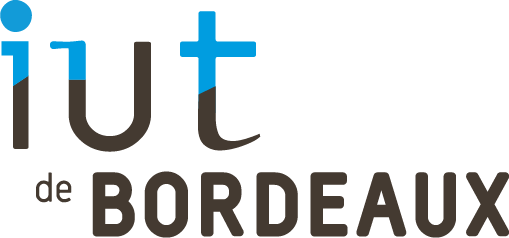

# STANDARDS DE DÉVELOPPEMENT

### Membres de l'équipe : El Mesaoudi Meftah Younes, Le Flohic Carole, Crispel Clément, Noyer Émilien, Briend Donovan

## Pour le développement de notre application, nous allons utiliser les standards de développement suivants : 
- code (noms des variables et fonctions en anglais) ;
- éviter les "grands" commits ;
- supprimer les branches inutiles ;
- au moins 1 branche par User Story ;
- notation : camel case ;
- dépôt GitLab en anglais (commits, issues…) ;
- charte graphique prédéfinie :
  - couleurs : white, #be7cff, #ffffff, #000000, #292929, #604174, #302336, #91d7f2 ;
  - police d’écriture : Verdana, sans-serif ;
  - apparence des pages Web prédéfinie selon des maquettes ;
- Architecture MVC (modèle-vue-contrôleur) ;
- Tabulation de 4 caractères ;
- Variable de sécurité préfixé par un underscore
- variables contenant des informations importantes, alors utilisation de la méthode
POST (exemple : variables contenant des informations que seul
l'administrateur peut avoir accès).

## Les outils choisies pour tester nos standards 

Symfony check:security : permet de vérifier les failles de sécuritées
    - Vérifie le fichier composer.lock des dépendances installées 

PhpStan :  PHPStan analyse l'ensemble de votre base de code     et  recherche les bogues les plus évidents et les plus délicats. 

Twigcs : Il vérifie la base de code pour les violations des normes de codage.

PHPCodeSniffer : 
- PHP_CodeSniffer est un ensemble de deux scripts PHP ;    
- Le script principal phpcs qui tokenise les fichiers PHP, JavaScript et CSS pour détecter les violations d'une norme de codage définie.  
- Un second script phpcbf pour corriger automatiquement les violations de la norme de codage.    
- PHP_CodeSniffer est un outil de développement essentiel qui garantit que votre code reste propre et cohérent.   

## Les commandes à effectuées pour tester nos standards 

Symfony security : 
  - symfony check:security 

PhpStan : 
  - vendor/bin/phpstan analyse le/chemin/de/votre/choix

Twigcs : 
  - vendor/bin/twigcs le/chemin/de/votre/choix

PHPCodeSniffer : 
  
 <b> Code Correcteur : </b>

- vendor/bin/phpcs src/Controller/

